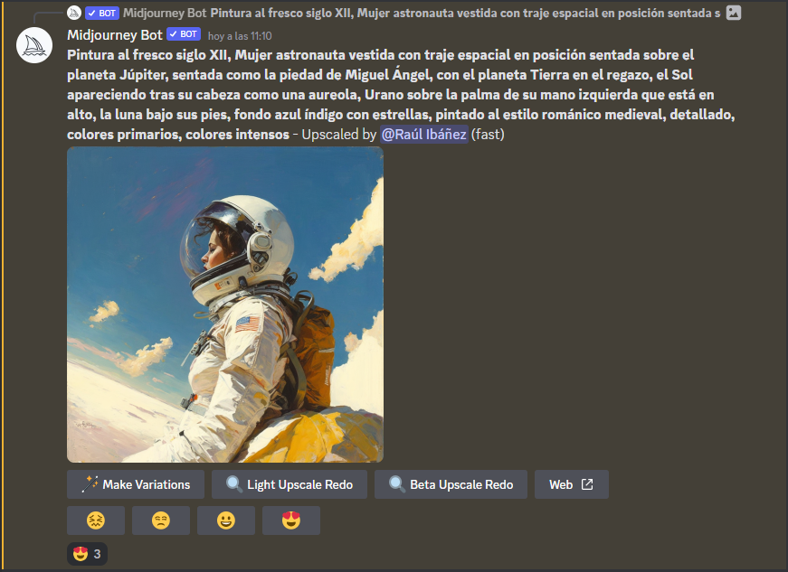

# Midjourney Voter

**Midjourney Voter** is a simple bot for Discord developed in Node.js to run Art AI competitions based on Midjourney Bot.

Once installed and configured, it will capture all images produced by Midjourney and store them on an Airtable database.

Discord users will be able to vote Midjourney images reacting with this emoji (😍).

Please, check a [live example](https://upsteam.es/midjourney) in action. The listing has been made with the nocode tool [Softr.io](https://www.softr.io/) embedded in Wordpress.

This tool has been designed for the spanish hackathon [Up! Steam](https://upsteam.es/), which is focused on encouraging teaching-learning STEAM disciplines (Science, Technology, Arts, Engineering and Mathematics) to 10-16yo kids in Comunidad Valenciana (Spain).

## Instructions

Here is the outline of the steps to install and run the bot. If you need extra help following these, feel free to join the Up! Steam Discord server and ask for help.

1. Create a Discord app and install bot on Discord.
2. Clone this repository
3. Rename .env.example to .env and reaplace all values (discord ids, airtable token api, ...)
4. Run project. You should use a process management tool like [PM2](https://pm2.keymetrics.io/docs/usage/quick-start/).

## License

[MIT](https://choosealicense.com/licenses/mit/)